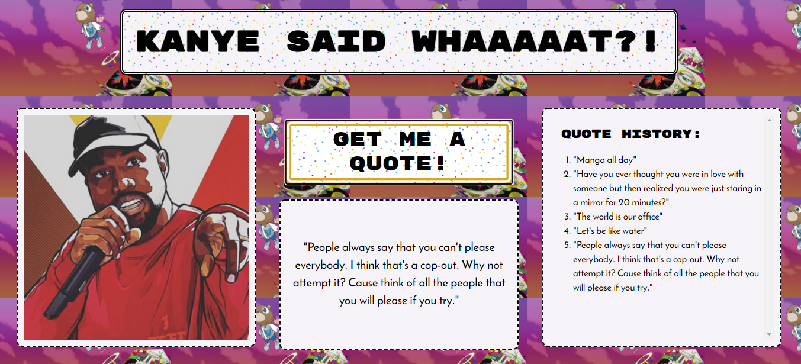

# Kanye West Quote Generator



###### September 2020

_I did a major refactor of this app which included separating out the functionality, styling and HTML elements, making my code cleaner and more robust and I added a new feature which is a quote history list._

###### May 2020

_I really enjoyed working on this project and learnt about lot of new concepts including callback functions, asynchronous callback functions, inline functions, promises, .then, JSON, fetch, get requests and API's!_

## Main Learning Points:

- JSON (JavaScript Object Notation) is an interchange format. It is a syntax for storing and exchanging data. JSON data is written as name / value pairs and is almost identical to JS objects (keys/values). A JSON value must be one of the following data types: string, number object, array, boolean, null. It cannot be a function, date or undefined.
- Fetch is a function that can send http requests - in this case a get request. The fetch API provides and interface for fetching resources. The fetch() method takes one mandatory argument - the path to the resource that you want to fetch. It returns a promise that resolves to the the response to that request.
- A promise can have 3 states - resolved, pending and rejected. A promise is 'then-able'.
- .then takes in a callback function.
- A callback function is a function passed into another function as an argument which is then invoked inside the outer function to complete some kind of routine or action.
- An example of an asynchronous callback function is a function that is executed inside a .then() block chained onto the end of a promise after that promise fulfils or rejects. This structure is used in many modern web API's such as fetch().

```javascript
function runFetch() {
  fetch("https://api.kanye.rest")
    .then(function (response) {
      return response.json();
    })
    .then(function (data) {
      console.log(data);
      document.getElementById("quote").innerHTML = '"' + data.quote + '"';
    });
}
```

## Built with:

- HTML
- CSS
- JavaScript

## Getting Started:

Clone the repo as instructed below

## Prerequisites:

No prerequisites

## Installation

1.  Clone the repo

`git clone https://github.com/katiehawcutt/kanye-west-quote-generator.git`

2. Run the index.html in a browser

## Usage

Click the button to get a quote!
